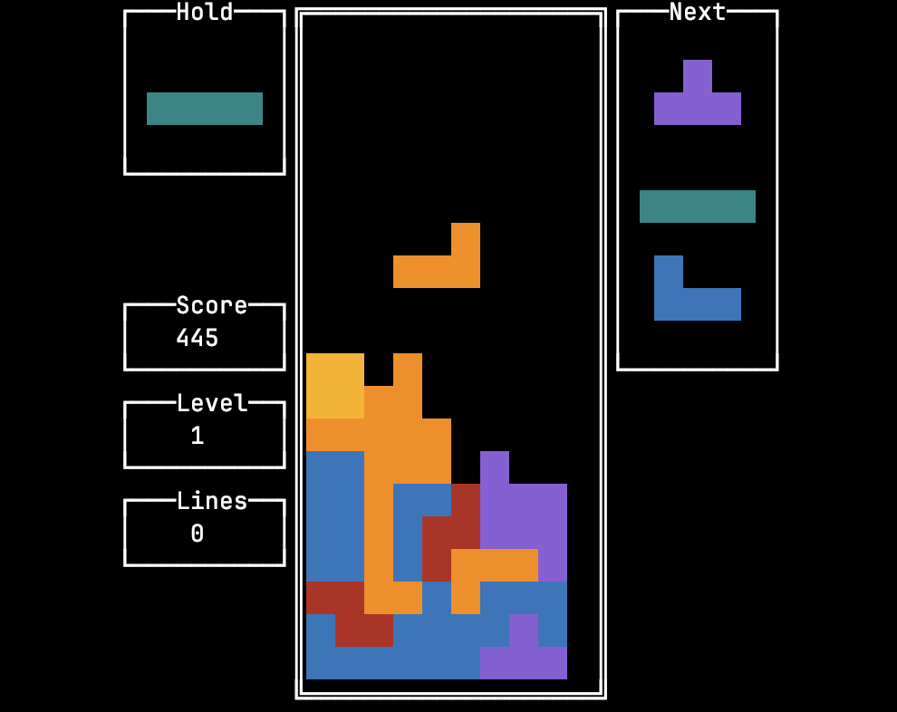

[简体中文](README_CN.md) | **[English](README.md)**

**Most content of this article is machine-translated from [README_CN.md](README_CN.md) using [DeepSeek](https://www.deepseek.com/). :)**

---


[](https://github.com/yhlooo/go-tetris/releases/latest)
[](https://github.com/yhlooo/go-tetris/actions/workflows/release.yaml)

# go-tetris

This project is a Tetris library implemented in Go, and also a playable Tetris game that runs in browsers (based on [Wasm](https://webassembly.org/)) or terminals.

## Play!

### In Browser


Visit [Tetris](https://yhlooo.github.io/go-tetris/) to start playing right away.

### In Terminal



Install and run Tetris via one of the following methods:

**Download Prebuilt Binary:**

Download the executable binary from [Releases](https://github.com/yhlooo/go-tetris/releases), unzip it, and place the `tetris` file in any directory in your `$PATH`.

Then execute:

```bash
tetris
```

**Use Docker:**

```bash
docker run --rm --name tetris -it ghcr.io/yhlooo/tetris:latest
```

**Build from Source:**

```bash
# Download and build the source
go install github.com/yhlooo/go-tetris/cmd/tetris@latest
# Run
$(go env GOPATH)/bin/tetris
```

## Build the Project

**Terminal UI:**

```bash
go run ./cmd/tetris
```

**Web UI:**

```bash
GOOS=js GOARCH=wasm go build -o web/app.wasm ./cmd/tetris-wasm && go run ./cmd/tetris-wasm
```

Then open <http://localhost:8000> in your browser.

## Build Your Own Tetris

This project is not just a playable Tetris game, but also an easy-to-integrate Tetris library. You can use it to build your own Tetris game. Refer to the [Tetris](pkg/tetris/tetris.go#L9) interface for API details.

**Note: This package is still in its very early stage, and the interfaces may have BREAKING CHANGES.**

### Implemented Features

- Randomizer
  - 7-Bag
  - Customizable
- Rotation System
  - Super Rotation System (SRS)
  - Customizable
- Scoring System
  - Follow the Tetris Guidelines
    - Soft Drop
    - Hard Drop
    - T-Spin
    - T-Spin Single
    - T-Spin Double
    - T-Spin Triple
    - Single Line Clear
    - Double Line Clear
    - Triple Line Clear
    - Tetris
    - Back-to-Back
  - Customizable
- Hold
- Piece preview
- Ghost piece
- Lock Down Delay

## Acknowledgements

- [Tetris Wiki](https://tetris.wiki/): Provides detailed explanations of Tetris mechanics.
- [rivo/tview](https://github.com/rivo/tview): Provides powerful terminal-based UI components.
- [maxence-charriere/go-app](https://github.com/maxence-charriere/go-app): Provides Web UI implementation via [Wasm](https://webassembly.org/).
